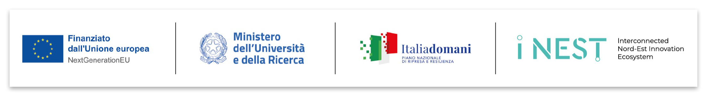
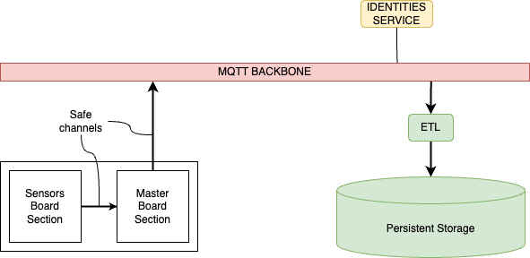
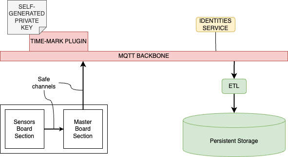
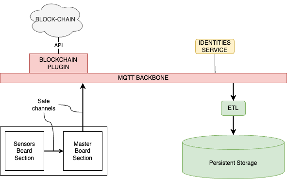

>Programma iNEST Codice ECS00000043 finanziato sui fondi PNRR MUR – M4C2” – Investimento 1.5. Avviso “Ecosistemi dell’Innovazione” 
>CUP progetto B33D24000100004

# BRAID

> Nell'ambito dell'agri-food digitale, il progetto BRAID mira a rivoluzionare la gestione della supply chain attraverso l'introduzione di una piattaforma basata sulla blockchain. Il suo fulcro è lo sviluppo e l'implementazione di tecnologie avanzate per una supply chain sostenibile, con enfasi particolare sulla gestione, integrazione e autenticazione di dati eterogenei.
> Al centro della nostra innovazione, progettiamo un prototipo di tracker GPS/LTE arricchito con sensori MEMS capaci di rilevare temperatura, luminosità, umidità, qualità dell'aria e movimenti attraverso una piattaforma inerziale a 6 assi. Questo dispositivo non solo monitorerà le condizioni dei prodotti trasportati, ma garantirà anche l'integrità e l'autenticità dei dati generati, sfruttando la natura immutabile della blockchain.
> La sfida principale è la gestione efficiente di volumi elevati di dati, assicurando la loro consultabilità e minimizzando le risorse richieste per la creazione e registrazione. Questo è cruciale per mantenere la sostenibilità del sistema in un settore dove le risorse sono essenziali. Il nostro focus specifico è il trasporto di vino, con una particolare attenzione al monitoraggio e alla gestione di una confezione da sei bottiglie di vino, garantendo che ogni fase del loro viaggio rispetti gli standard ottimali per la conservazione e l'autenticità del prodotto.

# Architettura della soluzione
Per evidenziare benefici e limiti della soluzione basata su blockchain è stata definita una architettura generale del sistema allo stato dell'arte che supporta sia un modello di trust basato su Certification Authorities sia basato su Block Chain.
Nei paragrafi seguenti vengono illustrati in prima istanza gli elementi comuni alle due architetture. Successivamente viene illustrato il dettaglio di "verifica di autenticità ed inalterabilità", declinata nelle due varianti.

Nel diagramma è possibile identificare gli attori coinvolti nella disamina:
* Dispositivo hardware, costituito da sezione sensori e sezione master.
* Backbone MQTT di raccolta e distribuzione dati
* Identities service per la gestione centralizzata delle capability dei diversi attori aventi accesso alla backbone
* ETL agente software per la trascrizione dei dati in un database relazionale al fine di ottimizzare la fruizione delle informazioni.

## Variante basata su Certification Authority

Viene aggiunto al diagramma generico:
* Time-mark plugin, che si integra in mosquitto per aggiungere una marca temporale ad ogni messaggio che attraversa il broker

## Variante basata su Block Chain

Viene aggiunto al diagramma generico:
* Blockchain plugin, che si integra in mosquitto per firmare, tramite blockchain, tutti i messaggi che attraversano il broker

# Riferimenti del progetto

I progetti specifici per il progetto BRAID (firmware e backend) sono stati inclusi direttamente in questo repository rispettivamente nelle cartelle 

* braid-backend - contiente l'infrastruttura cloud completa di configuazioni per broker MQTT, database postgres ed ETL
* braid-firmware - contiene il codice del firmware sviluppato per il PoC

Sono inoltre stati rilasciati i seguenti progetti sotto forma di repository pubblici dedicati:

* [mosquitto-oauth-plugin](https://github.com/iotinga/mosquitto-oauth-plugin) - Plugin mosquitto per l'autenticazione dei client su broker MQTT
* [mosquitto-message-sign-plugin](https://github.com/iotinga/mosquitto-message-sign-plugin) - Plugin mosquitto per la marca temporale certificata di tutti i messaggi ricevuti

Infine sono stati prodotti i seguenti documenti "guidelines":

* [device-guidelines](guidelines/hardware/device-guidelines.md) - Descrive le accortezze da prendere in fase di progettazione sviluppo hardware al fine di preservare le caratteristiche di sicurezza del softare `braid-firmware`
* [notes-on-gsm-modems](guidelines/hardware/notes-on-gsm-modems.md) - Una disamina sulla gestione di modem GSM in sistemi embedded
* [mqtt-protocol](guidelines/cloud/mqtt-protocol.md) - La specifica del protocollo con cui i device / agent dialogano con il cloud di raccolta dati
* [certified-run](guidelines/cloud/certified-run.md) - Accorgimenti da prendere in fase di rilascio e run del broker MQTT al fine di rendere verificabile la genuinità del software broker in esecuzione