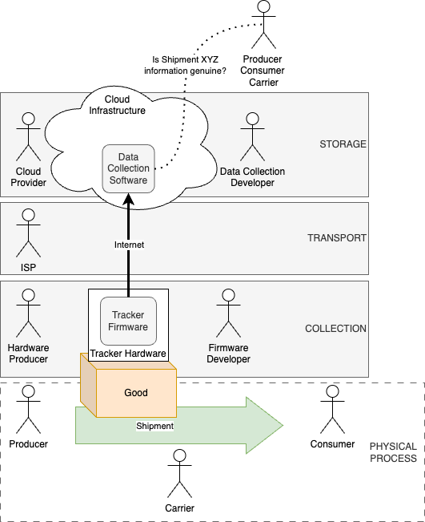

>Programma iNEST Codice ECS00000043 finanziato sui fondi PNRR MUR – M4C2” – Investimento 1.5. Avviso “Ecosistemi dell’Innovazione” 
>CUP progetto B33D24000100004

# BRAID

> Nell'ambito dell'agri-food digitale, il progetto BRAID mira a rivoluzionare la gestione della supply chain attraverso l'introduzione di una piattaforma basata sulla blockchain. Il suo fulcro è lo sviluppo e l'implementazione di tecnologie avanzate per una supply chain sostenibile, con enfasi particolare sulla gestione, integrazione e autenticazione di dati eterogenei.
> Al centro della nostra innovazione, progettiamo un prototipo di tracker GPS/LTE arricchito con sensori MEMS capaci di rilevare temperatura, luminosità, umidità, qualità dell'aria e movimenti attraverso una piattaforma inerziale a 6 assi. Questo dispositivo non solo monitorerà le condizioni dei prodotti trasportati, ma garantirà anche l'integrità e l'autenticità dei dati generati, sfruttando la natura immutabile della blockchain.
> La sfida principale è la gestione efficiente di volumi elevati di dati, assicurando la loro consultabilità e minimizzando le risorse richieste per la creazione e registrazione. Questo è cruciale per mantenere la sostenibilità del sistema in un settore dove le risorse sono essenziali. Il nostro focus specifico è il trasporto di vino, con una particolare attenzione al monitoraggio e alla gestione di una confezione da sei bottiglie di vino, garantendo che ogni fase del loro viaggio rispetti gli standard ottimali per la conservazione e l'autenticità del prodotto.

# Analisi dei rischi
Quando si parla di sicurezza informatica è sempre necessario definire gli obiettivi di sicurezza, analizzare i rischi legati al loro conseguimento ed identificare azioni e tecniche da impiegare per mitigare tali rischi.

## Attori e scenario applicativo
Nello scenario applicativo contemplato dal progetto Braid gli attori principali coinvolti sono il produttore (Producer), il consumatore (Consumer) ed il trasportatore (Carrier). A questi attori, per completare il quadro dal punto di vista informatico vanno aggiunti il produttore dell'hardware (Hardware Producer), lo sviluppatore del firmware (Firmware Developer), il fornitore di connettività mobile (ISP), lo sviluppatore del sistema di raccolta dati (Data Collection Developer) ed il provider di servizi cloud (Cloud Provider) dove il sistema di raccolta data sarà in esecuzione. Nello specifico, il produttore invia un bene al consumatore attraverso i servizi offerti dal trasportatore. Durante il trasporto il bene verrà esposto a condizioni ambientali variabili e potenzialmente impattanti sulle caratteristiche del prodotto (in particolare del vino).

Scopo del progetto Braid è, nello scenario esposto, fornire un sistema di raccolta dati (BRAID) la cui integrità ed autenticità sia verificabile da parte degli attori principali. BRAID è costituito da un firmware (realizzato da un Firmware Developer), in esecuzione su uno specifico hardware (realizzato da un Hardware Producer), e da un software cloud di raccolta dati (realizzato da un Data Collection Developer) in esecuzione presso una infrastruttura cloud (costruita e mantenuta da un Cloud Provider). Nello schema seguente sono riportati tutti gli elementi citati. 

## Analisi dei rischi di sicurezza

I principali rischi all'integrità dei dati arrivano da tentativi di manomissione volontaria del sistema BRAID da parte di uno dei tre attori principali coinvolti, allo scopo di ottenere vantaggi economici diretti o una riduzione del rischio sui propri processi interni.

Nella tabella seguente vengono riportati i principali attacchi identificati e la loro valutazione senza e con l'adozione dei sistema BRAID.

|   | ACCATTANTI                    | DESCRIZIONE                                                                                                                                                                           | RISCHIO INIZIALE | AZIONE                                                                                                                                                                                                                   | RISCHIO FINALE |
|---|-------------------------------|---------------------------------------------------------------------------------------------------------------------------------------------------------------------------------------|------------------|--------------------------------------------------------------------------------------------------------------------------------------------------------------------------------------------------------------------------|----------------|
| A | Producer                      | Invio di un Good già alterato portando come giustificazione l'errata gestione del Good in fase di trasporto                                                                           | Basso            | I dati generati vengono firmati dal Tracker all'origine, garantendo originalità ed inalterabilità dei dati. Ogni messaggio è dotato di sequence number al fine di rilevare cancellazioni di intere porzioni di dati.     | Nullo          |
| B | Carrier                       | Gestione errata del Good con conseguente alterazione delle caratteristiche portando come giustificazione la spedizione di un Good già alterato                                        | Alto             | I dati generati vengono firmati dal Tracker all'origine, garantendo originalità ed inalterabilità dei dati. Ogni messaggio è dotato di sequence number al fine di rilevare cancellazioni di intere porzioni di dati.     | Nullo          |
| C | Consumer                      | Richiesta di rimborsi totali o parziali anche per Good la cui gestione è stata corretta                                                                                               | Medio            | I dati generati vengono firmati dal Tracker all'origine, garantendo originalità ed inalterabilità dei dati. Ogni messaggio è dotato di sequence number al fine di rilevare cancellazioni di intere porzioni di dati.     | Nullo          |
| D | Producer + Carrier + Consumer | Scredito della piattaforma BRAID al fine di limitarne l'adozione                                                                                                                      | Basso            | Il rischio viene considerato basso in quanto richiede accordi sistematici tra attori che in realtà beneficiano dal corretto funzionamento della piattaforma. Non vengono predisposte azioni specifiche.                  | Basso          |
| E | Hardware Producer             | I dispositivi prodotti e consegnati, non potendo essere aperti per verifica, potrebbero non rispettare i criteri di sicurezza imposti, fino a montare componenti o firmware alterati. | Alto             | Documentazione dettagliata del processo produttivo dei singoli esemplari e tracciabilità.                                                                                                                                | Basso          |
| F | Firmware Developer            | Il firmware dei dispositivi potrebbe includere backdoor o non implementare correttamente (volontariamente) algoritmi e protocollo di sicurezza.                                       | Alto             | Il software del Tracker deve essere opensource, devono essere impiegate tecniche volte alla riproducibilità delle build, la firma e la verifica del binario generato.                                                    | Nullo          |
| G | ISP                           | Trattandosi di Internet, l'integrità della rete non può essere data per scontata o verificabile.                                                                                      | Alto             | Il Tracker deve comunicare con il Data Collection Software utilizzando tecniche in grado di garantire l'identità dei partecipanti ed una comunicazione sicura (es. TLS).                                                 | Nullo          |
| H | Cloud Provider                | Potrebbe eseguire codice alterato rispetto quanto definito dal Data Collection Developer.                                                                                             | Alto             | I dati generati vengono firmati dal Tracker all'origine, garantendo originalità ed inalterabilità dei dati. Ogni messaggio è dotato di sequence number al fine di rilevare cancellazioni di intere porzioni di dati.     | Nullo          |
| I | Data Collection Developer     | Il software di raccolta dati potrebbe alterare o cancellare parte dei dati raccolti.                                                                                                  | Alto             | I dati generati vengono firmati dal Tracker all'origine, garantendo originalità ed inalterabilità dei dati. Ogni messaggio è dotato di sequence number al fine di rilevare cancellazioni di intere porzioni di dati.     | Nullo          |
| J | Tampering                     | Il Tracker potrebbe essere manomesso al fine di carpire le chiavi crittografiche o alterare con fini malevoli la configurazione dell'hardware                                         | Alto             | Definizione di un documento di best-practice per la realizzazione di un hardware sicuro allo stato dell'arte                                                                                                             | Basso          |
| K | Poisoning                     | Il dispositivo potrebbe essere collocato all'interno di un ambiente controllato in grado di fornire informazioni false a tutti i sensori                                              | Medio            | Il Tracker deve essere fissato sul Good utilizzando tecnologie simili a quelle utilizzate per l'antitaccheggio. Le condizioni a cui il bene è esposto saranno le stesse del Tracker.                                     | Basso          |
| L | Substitution                  | Al Consumer potrebbe essere consegnato un Good diverso da quello associato al tracker                                                                                                 | Medio            | Deve essere definito un protocollo di abbinamento e disabbinamento del Tracker dal Good.                                                                                                                                 | Nullo          |

Dall'analisi dei rischi è evidente che l'intervento di BRAID nello scenario descritto è in grado di annullare la maggior parte dei rischi e che i rischi rimanenti sono da considerarsi bassi. 

Per raggiungere questi risultati, riassumiamo di seguito le azioni che il progetto BRAID dovrà coprire:

1. Definire linee guida per la progettazione e realizzazione di un hardware sicuro per il Tracker;
2. Il software del Tracker deve essere reso opensource e il deployment deve impiegare tecniche volte alla riproducibilità delle build, la firma e la verifica del binario generato;
3. I dati generati devono essere firmati dal Tracker all'origine;
4. Il Tracker deve comunicare con il Data Collection Software utilizzando tecniche in grado di garantire l'identità dei partecipanti ed una comunicazione sicura;
5. Deve essere definito un protocollo di abbinamento e disabbinamento del Tracker dal Good.

Mentre le azioni 1 3 e 5 devono essere trattate nello specifico, le azioni 2 e 4 sono già ampiamente coperte in letteratura. In particolare per il punto 4 risulta poco edificante l'utilizzo della blockchain, dati i limiti analizzati in [1], vista la presenza di tecnologie come SSL/TLS.
Infine, l'azione 1 non si presta ad una analisi dal punto di vista della sicurezza informatica. Di seguito quindi verranno analizzate nel dettaglio le azioni 3 e 5.

### Firma dei dati all'origine
Sebbene in prima battuta l'impiego di modello distribuito (blockchain) o centralizzato (basato su CA) possa sembrare equivalente, le caratteristiche particolari del dominio applicativo pongono serie limitazioni all'impiego della blockchain in questo particolare punto del sistema. Come riportato da [2], nonostante la blockchain offra potenziali benefici in termini di sicurezza e privacy per l'IoT, le limitazioni hardware dei dispositivi embedded ne rendono complessa l'implementazione diretta. Pertanto, viene suggerita l'adozione di tecnologie alternative più adatte a tali contesti. Data l'assenza di effettivi progressi che invalidino quanto riportato in letteratura, e data la necessità di arrivare ad una soluzione TRL 7 (dimostrata in un ambiente operativo reale o molto vicino a quello reale), l'utilizzo della tecnologia blockchain al fine di firmare i dati all'origine è stata scartata.

### Protocollo abbinamento / disabbinamento Tracker dal Good.
Questo aspetto è fondamentale per raggiungere un adeguato livello di sicurezza, andando a coinvolgere direttamente gli attori principali delle interazioni. Inoltre, trattandosi di azioni svolte all'avvio ed alla conclusione del trasporto, possono coinvolgere agenti ed impiegare risorse maggiori. Per questo motivo, l'impiego della tecnologia blockchain può essere valutata in parallelo ai classici approcci basati su CA. 

# Architettura della soluzione
Al fine di poter realizzare un PoC del sistema BRAID è necessario realizzare una infrastruttura minimale che ci permetta di raffrontare soluzioni che utilizzino la tecnologia blockchain in alternativa alle tradizionali. Per semplificare i confronti abbiamo definito una architettura volta a minimizzare i software / agent coinvolti ed al contempo generica. Per questo motivo è stato abbandonato l'inizialmente contemplato protocollo REST HTTP in favore di MQTTv5. Tramite plugin, questa architettura può integrare sia tecnologie tradizionali sia basate su blockchain.

Nei paragrafi seguenti vengono illustrati in prima istanza gli elementi comuni alle due architetture. Successivamente viene illustrato il dettaglio di "verifica di autenticità ed inalterabilità", declinata nelle due varianti.

Nel diagramma è possibile identificare sia il Tracker che il Data Collection software, costituito da:
* Backbone MQTT di raccolta e distribuzione dati
* Identities service per la gestione centralizzata delle capability dei diversi attori aventi accesso alla backbone
* ETL agente software per la trascrizione dei dati in un database relazionale al fine di ottimizzare la fruizione delle informazioni.

## Variante basata su Certification Authority

Viene aggiunto al diagramma generico:
* Time-mark plugin, che si integra in mosquitto per aggiungere una marca temporale ad ogni messaggio che attraversa il broker

## Variante basata su blockchain

Viene aggiunto al diagramma generico:
* Blockchain plugin, che si integra in mosquitto per firmare, tramite blockchain, tutti i messaggi che attraversano il broker

# Riferimenti del progetto

I progetti specifici per il progetto BRAID (firmware e backend) sono stati inclusi direttamente in questo repository rispettivamente nelle cartelle 

* braid-backend - contiente l'infrastruttura cloud completa di configuazioni per broker MQTT, database postgres ed ETL
* braid-firmware - contiene il codice del firmware sviluppato per il PoC

Sono inoltre stati rilasciati i seguenti progetti sotto forma di repository pubblici dedicati:

* [mosquitto-oauth-plugin](https://github.com/iotinga/mosquitto-oauth-plugin) - Plugin mosquitto per l'autenticazione dei client su broker MQTT
* [mosquitto-message-sign-plugin](https://github.com/iotinga/mosquitto-message-sign-plugin) - Plugin mosquitto per la marca temporale certificata di tutti i messaggi ricevuti
* [mosquitto-iota-blockchain-plugin](https://github.com/iotinga/mosquitto-iota-blockchain-plugin) - Plugin mosquitto per l'inserimento in blockchain [IOTA](https://www.iota.org/) di tutti i messaggi gestiti dal broker

Infine sono stati prodotti i seguenti documenti "guidelines":

* [device-guidelines](guidelines/hardware/device-guidelines.md) - Descrive le accortezze da prendere in fase di progettazione sviluppo hardware al fine di preservare le caratteristiche di sicurezza del softare `braid-firmware`
* [notes-on-gsm-modems](guidelines/hardware/notes-on-gsm-modems.md) - Una disamina sulla gestione di modem GSM in sistemi embedded
* [mqtt-protocol](guidelines/cloud/mqtt-protocol.md) - La specifica del protocollo con cui i device / agent dialogano con il cloud di raccolta dati
* [certified-run](guidelines/cloud/certified-run.md) - Accorgimenti da prendere in fase di rilascio e run del broker MQTT al fine di rendere verificabile la genuinità del software broker in esecuzione

## Prossimi passi:

* Definizione del protocollo di abbinamento Tracker / Good sulla architettura proposta
* Implementazione del protocollo di abbinamento tramite blockchain e CA
* Definizione benchmark e passi fase sperimentale
* Raccolta ed analisi dei dati sperimentali

---

#### Bibliografia

[1] Vukolić, M. (2015). The Quest for Scalable Blockchain Fabric: Proof-of-Work vs. BFT Replication. In International Workshop on Open Problems in Network Security (pp. 112-125). Springer. DOI: 10.1007/978-3-319-39028-4_9

[2] Khan, M. A., Khan, M. I., & Imran, M. (2022). Blockchain Systems in Embedded Internet of Things: Systematic Literature Review, Challenges Analysis, and Future Direction Suggestions. Electronics, 11(23), 4020.