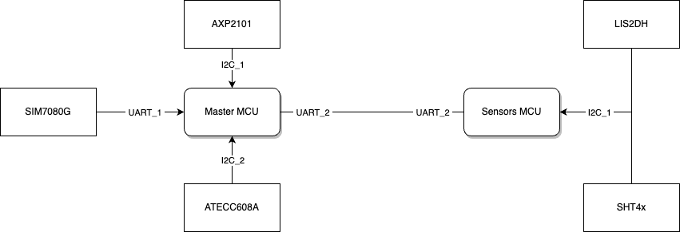
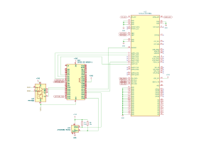
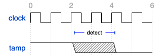
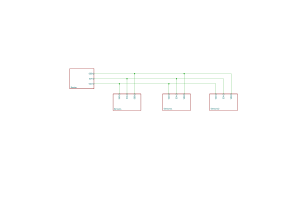
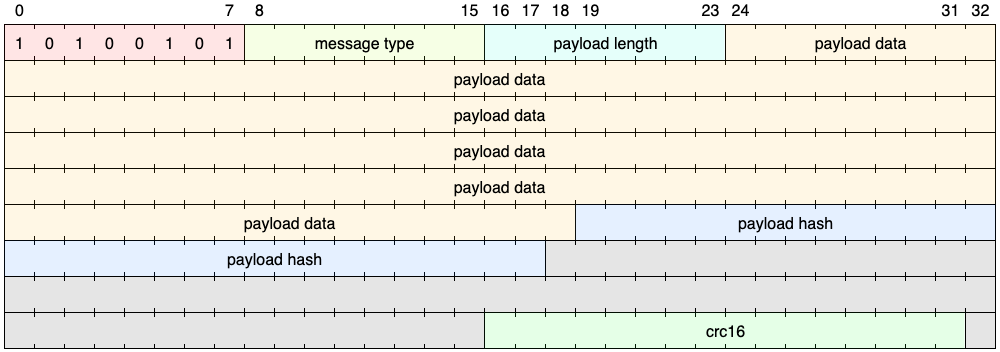
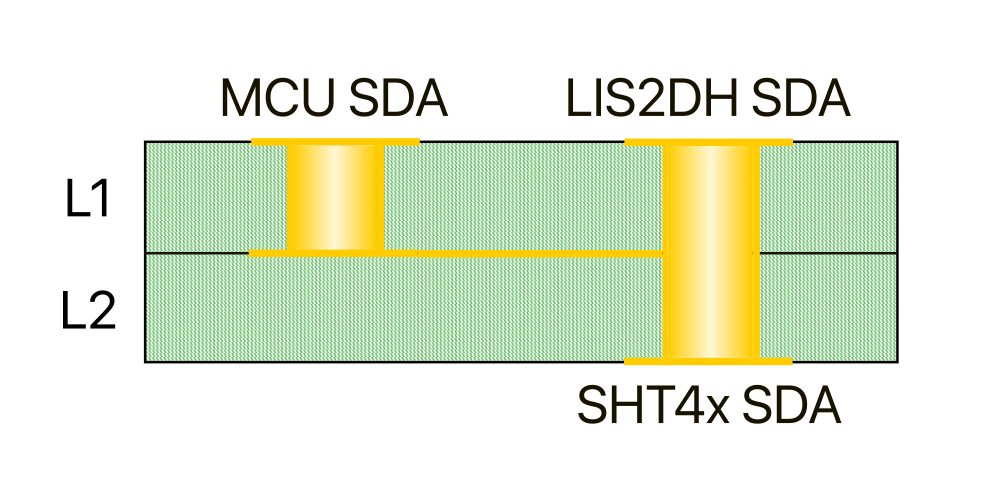
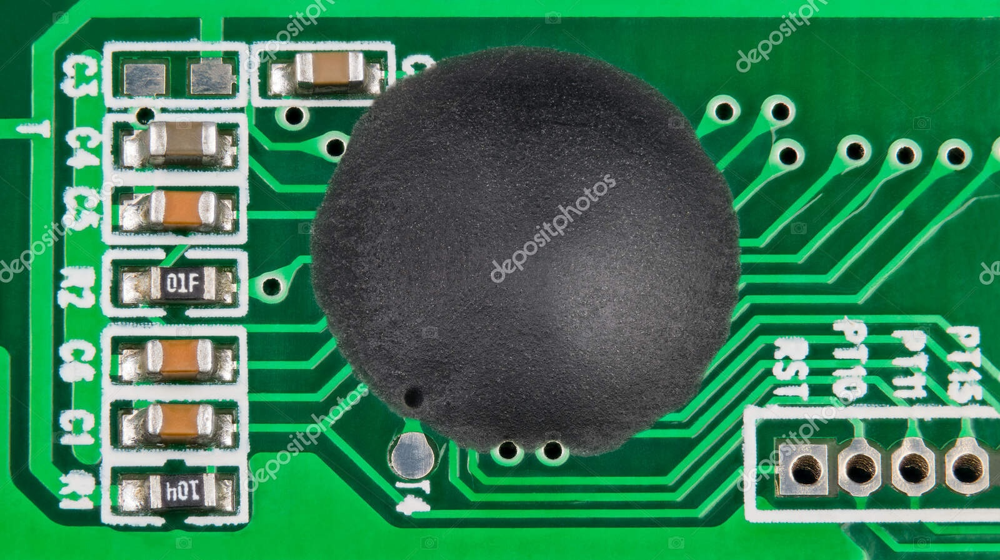

# BRAID Hardware Integration Guidelines <!-- omit in toc -->

## Introduction
The purpose of this document is to provide integration guidelines for Project BRAID, which consists of two embedded MCUs: the master MCU and the sensors MCU. These guidelines focus on ways of guaranteeing the physical security of data used by the devices, both in transit and stored.

*Figure: logical schema of buses*

## Bill of materials
A reference bill of material is provided below. Note that for more detailed part numbers and components lists, it is recommended to refer to the various manufacturer's data sheets or documentation. In particular, the master MCU's development board schematics and documentation from LilyGo.

| Quantity | Part Number       | Manufacturer | Description                 |
| -------- | ----------------- | ------------ | --------------------------- |
| 1        | ESP32-S3          | Espressif    | Master MCU                  |
| 1        | STM32L031K6U6TR   | STM          | Sensors MCU                 |
| 1        | ATECC608A-MAHDA-S | Microchip    | Cryptographic processor     |
| 1        | SHT40-BD1F        | Sensirion    | Humidity/Temperature sensor |
| 1        | LIS2DH12TR        | STM          | Accelerometer               |
| 1        | SIM7080G          | SIMCOM       | GPS/Cat-M modem             |
| 1        | AXP2101           | X-Powers     | Power management unit       |
| 4        |                   |              | 10k Ohms resistor           |

## Master package
The master package consists of an Espressif ESP32-S3 chip, connected to:

| Quantity | Part number | Manufacturer | Description             | Connection |
| -------- | ----------- | ------------ | ----------------------- | ---------- |
| 1        | ATECC608A   | Microchip    | Cryptographic processor | I²C        |
| 1        | AXP2101     | X-Powers     | Power management unit   | I²C        |
| 1        | SIM7080G    | SIMCOM       | GPS/Cat-M modem         | UART       |
| 1        | L031K6      | ST           | Sensors MCU             | UART       |

### Reference schematic
A reference design is provided below. The schematic follows that of the LilyGo SIM7080G development board. For more extensive reference, such as connections to the AXP2101 power management unit.

Note that the MAX483 transceiver was used as an example and a lower power chip is recommended for the final design.

*Figure: example implementation schematic with physical connections*

### On-chip security
The master MCU already ensures some degree of physical protection by physically disabling JTAG connections and burning some settings/secrets to eFuses, which become non-writeable/readonly after factory programming the device. Moreover, all critical data is stored encrypted in the internal persistent flash (NVS), which is not physically accessible via traces or pins. All flash-stored data is also checked for integrity on read with CRC32.

The SIM7080G modem is to be treated as a black box. It contains secrets but the manufacturer employs their own security and anti-tamper measures which are not configurable externally.

The ATECC chip also implements proprietary measures against physical access to the device, in the form of memory data signing and locking of the key slots. Communication between the MCU and the chip is signed and error checked by manufacturer-provided software. As such, no special measures are required to protect the physical bus.

### Physical anti-tamper
On the master MCU, any pin can be configured as a tamper detector. All configured pins must be normally pulled high (to the 3.3V rail) and will trigger an event when the connection is broken, getting pulled down internally. Pin 37 is configured by default to behave as tamper detector. The PMU chip also provides some anti-tamper measures in the form of power measurement events. By default, the PMU will trigger an anti tamper event when the battery is disconnected or removed.

When the device receives a tamper event, all secrets are erased from the internal NVS and the chip is reset.

The anti tamper pins should be connected to physical switches or buttons attached to the external case of the device. Generally, anti tamper pins should be able to activate when opening the case or releasing a physical seal to prevent access to device internals.

Special care should also be given to the SIM module attached to the SIM7080G modem, since most modules do not prevent the SIM from being physically removed. Epoxy resin can be used to glue the SIM in place, and a connector with an appropriate design should be chosen.

*Figure: tamper detection timing for master MCU*

## Sensors package
The sensors package consists of an STM32 L031K6 chip, connected to:

| Quantity | Part number | Manufacturer | Connection | Description                 |
| -------- | ----------- | ------------ | ---------- | --------------------------- |
| 1        | SHT4x       | Sensirion    | I²C        | temperature/humidity sensor |
| 1        | LIS2DH      | ST           | I²C        | accelerometer               |
| 1        | ESP32-S3    | Espressif    | UART       | Master MCU                  |

### Reference schematic
A reference design is provided below. Note that the MAX483 transceiver was used as an example and a lower power chip is recommended for the final design.

*Figure: example implementation schematic with physical connections*

### On-chip security
Memory on the sensors MCU is both read and write protected with the following methods:
1. disabling JTAG/serial ports via eFuse
2. "readout protection" (RDP) permanently prevents flash memory read access from:
   - external serial/JTAG connections
   - software running temporarily in SRAM
3. "write protection" (WRP) disables external writes to the whole flash

Moreover, all critical data is saved onto the on-chip EEPROM, which is not physically accessible without first triggering other anti tamper measures.

### Physical anti-tamper
The sensors MCU has hardware-based anti tamper detection, configured on pins PA_0 and PA_2. Both pins must be normally pulled high (to the 3.3V rail) and will trigger an event when the connection is broken. An anti tamper event will also be fired if a debugger manages to read the internal EEPROM or tries to flash a new firmware.

The sensor MCU mus also be equipped with a small battery to ensure the anti tamper functionality works in case of deliberate brownout glitches. The L031K6 MCU has an absolute maximum current output (measured by the manufacturer) of 105 milliamperes. It is to be noted that this threshold will never be reached, the MCU being in power saving mode most of the time. Unused external IOs are also disabled in firmware and do not consume current at idle.
As such, a small lithium single cell battery will suffice.

When the device receives a tamper event, all secrets are erased from the internal EEPROM and the chip is reset.

## Inter-MCU communication
Master and sensors packages are interconnected using a RS-485 connection, with the possibility of connecting many sensor packages to a single master. An example RS-485 topology is outlined in the following schematic.

*Figure: RS-485 schematic with physical connections*

Data rates on the bus should not exceed 10Mbps, even during the most intensive data polling runs. A sane maximum bus length is 12 meters, as the length at which maximum data rate has been achieved on RS-485.

Data is exchanged between the sensors and main MCU using a custom binary protocol. Data packets are not encrypted, but are signed using HMAC-SHA256 using a shared key. If at any point the integrity of the data is broken or the key changes on one of the two sides, invalid packets will be discarded by the firmware.

As explained in the MCUs details sections, the communication keys will be voided on any triggering of the anti tamper systems.

The protocol is not to be considered resistant to strong external interference, because of the strict integrity check. Sane standards for RS-485 physical bus length and placement should be taken into consideration when connecting the sensor MCU to the master.

*Figure: data packet structure*

## Physical security
The I²C connections to the actual sensor chips are neither signed nor encrypted. While sniffing the connection is not considered an issue, measures of preventing data injection must be taken during hardware design. 

One possible approach for the sensors package is connecting the I²C devices as near as possible to the MCU, while masking the I²C data lines in the lower layer of a two-layer PCB. Moreover, blind and buried vias can also be factored into the design to further complicate the circuit. 

Careful PCB design following the previous recommendations would prevent physical access to the traces without partial destruction of the circuit, triggering other anti tamper measures in the process.

*Figure: example section of a PCB following recommendations*

It is also recommended to encase the MCUs and some of the sensors in epoxy resin to further complicate disassembly without incurring in chip destruction. Note that some sensor with parts purposefully exposed to the external environment will obviously fail if treated with resin, such as the temperature/humidity sensor.

*Figure: example application of epoxy on a PCB component*
